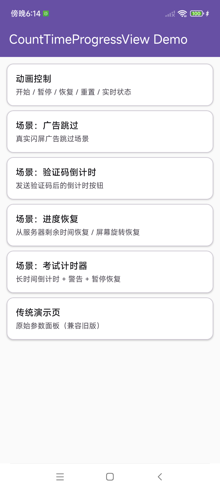
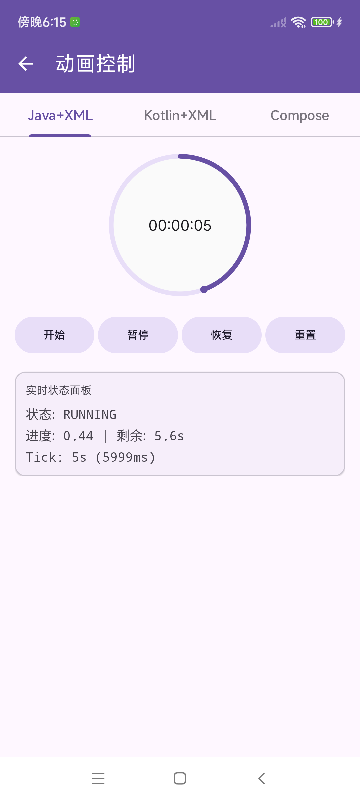

[](https://twitter.com/sfyc23)
[](https://weibo.com/sfyc23)
[](https://android-arsenal.com/api?level=21)
[](https://jitpack.io/#sfyc23/CountTimeProgressView)
[](LICENSE)

# CountTimeProgressView

> [中文](README.md) ｜ **English**

**CountTimeProgressView** is a Kotlin-based Android circular countdown progress view. Drop-in, zero runtime dependency, with first-class support for both classic **View (XML)** and **Jetpack Compose**. It ships a full state machine, lifecycle-aware pause/resume, warning threshold, and resume-from-progress out of the box.

Minimum supported version: **Android 5.0 (API 21)**.

---

## Preview

<p align="center">
  
  &nbsp;&nbsp;
  
</p>

The demo app includes real-world scenarios: **Ad Skip / Verification Code / Progress Resume / Exam Timer**, each with `Java + XML`, `Kotlin + XML`, and `Jetpack Compose` implementations.

---

## Features

- **One-line integration** — classic View / Jetpack Compose, no AppCompat required
- **Full state machine** — `IDLE` → `RUNNING` → `PAUSED` / `CANCELED` / `FINISHED`, all in a single listener
- **Multiple text styles** — `jump`, `second`, `clock` (mm:ss), `none`, plus custom `textFormatter`
- **Warning threshold** — auto-change color and fire a callback in the last N seconds (e.g. red in the final 3s)
- **Per-second tick** — fires only on second change; perfect for OTP buttons and ad-skip buttons
- **Resume anywhere** — start from `fromProgress` or `fromRemaining` for list recycling / server-synced countdowns
- **Lifecycle-aware** — `bindLifecycle(owner)` auto pauses in background and resumes on foreground
- **Rich visual customization** — gradient progress bar, `StrokeCap`, marker ball, custom interpolator
- **Click delay** — block clicks for the first N seconds with `disabledText` (ideal for splash ads)
- **Accessibility-friendly** — automatic `contentDescription`, `wrap_content` defaults to 84dp

---

## Install

### Step 1. Add the JitPack repository

In your root `settings.gradle` (or top-level `build.gradle`):

```groovy
dependencyResolutionManagement {
    repositoriesMode.set(RepositoriesMode.FAIL_ON_PROJECT_REPOS)
    repositories {
        google()
        mavenCentral()
        maven { url 'https://jitpack.io' }
    }
}
```

### Step 2. Add the dependency

In your app module `build.gradle`:

```groovy
dependencies {
    implementation 'com.github.sfyc23:CountTimeProgressView:2.1.0'
}
```

> Releases are published to JitPack automatically on every git tag. See the badge at the top for the latest version.

---

## Quick Start

### Option 1. XML layout

```xml
<com.sfyc.ctpv.CountTimeProgressView
    android:id="@+id/countTimeProgressView"
    android:layout_width="84dp"
    android:layout_height="84dp"
    app:backgroundColorCenter="#FF7F00"
    app:borderWidth="3dp"
    app:borderBottomColor="#D60000"
    app:borderDrawColor="#CDC8EA"
    app:markBallColor="#002FFF"
    app:markBallFlag="true"
    app:markBallWidth="3dp"
    app:titleCenterColor="#000000"
    app:titleCenterText="Click to skip"
    app:titleCenterSize="14sp"
    app:countTime="5000"
    app:startAngle="0"
    app:textStyle="jump"
    app:clockwise="true"
    app:warningTime="3000"
    app:warningColor="#FF3B30"
    app:clickableAfter="2000"
    app:disabledText="Please wait" />
```

### Option 2. Kotlin

```kotlin
with(countTimeProgressView) {
    countTime = 6000L
    textStyle = CountTimeProgressView.TEXT_STYLE_SECOND
    titleCenterText = "Skip (%s)s"

    // v2.1 Turn red in the last 3 seconds
    warningTime = 3000L
    warningColor = Color.parseColor("#FF3B30")

    // v2.1 Not clickable for the first 2 seconds
    clickableAfterMillis = 2000L
    disabledText = "Please wait"

    setOnCountdownEndListener {
        Toast.makeText(context, "Time's up", Toast.LENGTH_SHORT).show()
    }

    setOnClickCallback { overageTime ->
        if (isRunning) cancelCountTimeAnimation() else startCountTimeAnimation()
    }

    // Unified state listener
    setOnStateChangedListener { state ->
        Log.d("CTPV", "state=$state") // IDLE / RUNNING / PAUSED / CANCELED / FINISHED
    }

    // Fires only on second change — great for OTP / ad-skip buttons
    setOnTickListener { remainingMillis, remainingSeconds ->
        Log.d("CTPV", "Remaining: ${remainingSeconds}s")
    }

    setOnWarningListener { remainingMillis ->
        Log.d("CTPV", "About to finish!")
    }

    // Fires on every animation frame
    addOnProgressChangedListener { progress, remainingMillis ->
        Log.d("CTPV", "progress=$progress, remaining=$remainingMillis")
    }

    // Auto pause / resume with lifecycle
    bindLifecycle(this@SimpleActivity)

    startCountTimeAnimation()
    // Or start from a specific progress / remaining time:
    // startCountTimeAnimation(fromProgress = 0.5f)
    // startCountTimeAnimationFromRemaining(3000L)
}
```

### Option 3. Java

```java
countTimeProgressView.setCountTime(5000L);
countTimeProgressView.setTextStyle(CountTimeProgressView.TEXT_STYLE_CLOCK);
countTimeProgressView.setWarningTime(3000L);
countTimeProgressView.setWarningColor(Color.parseColor("#FF3B30"));
countTimeProgressView.setClickableAfterMillis(2000L);
countTimeProgressView.setDisabledText("Please wait");

countTimeProgressView.setOnCountdownEndListener(() ->
    Toast.makeText(this, "Time's up", Toast.LENGTH_SHORT).show());

countTimeProgressView.setOnStateChangedListener(state ->
    Log.d("CTPV", "state=" + state));

countTimeProgressView.setOnTickListener((remainingMillis, remainingSeconds) ->
    Log.d("CTPV", "Remaining: " + remainingSeconds + "s"));

countTimeProgressView.bindLifecycle(this);
countTimeProgressView.startCountTimeAnimation();
```

### Option 4. Jetpack Compose

The library ships a lightweight Compose adapter `CountTimeProgressViewCompose` (no Compose runtime dependency required). Use it directly inside `AndroidView`:

```kotlin
AndroidView(
    modifier = Modifier.size(84.dp),
    factory = { ctx ->
        CountTimeProgressViewCompose.create(ctx) {
            countTime = 5000L
            textStyle = CountTimeProgressView.TEXT_STYLE_SECOND
            warningTime = 3000L
            warningColor = Color.RED
            setOnStateChangedListener { state -> /* ... */ }
            setOnTickListener { _, sec -> /* ... */ }
            startCountTimeAnimation()
        }
    },
    update = { view ->
        CountTimeProgressViewCompose.update(view) {
            // React to Compose State changes here
        }
    }
)
```

---

## Typical Use Cases

| Scenario | Recommended Setup |
| :--- | :--- |
| **Splash ad skip button** | `textStyle=jump` + `clickableAfterMillis` + `disabledText` to prevent mis-taps |
| **OTP / Verification code** | `textStyle=second` + `setOnTickListener` (only on second change) |
| **Server-synced countdown** | `startCountTimeAnimationFromRemaining(remainMs)` |
| **List item countdown** | `startCountTimeAnimation(fromProgress = 0.7f)` + `bindLifecycle` |
| **Exam / long timer** | `textStyle=clock` (mm:ss) + `warningTime` to turn red near the end |
| **Jetpack Compose screens** | `AndroidView` + `CountTimeProgressViewCompose.create` |

---

## State Machine

```
          startCountTimeAnimation()
  IDLE ─────────────────────────────▶ RUNNING
   ▲                           │  ▲  │
   │ resetCountTimeAnimation() │  │  │ pause / resume
   │                           │  │  ▼
   └─────────── CANCELED / FINISHED ─── PAUSED
```

- `IDLE` — initial / after reset
- `RUNNING` — ticking
- `PAUSED` — manual or lifecycle-driven pause
- `CANCELED` — stopped via `cancelCountTimeAnimation()`
- `FINISHED` — naturally ended; `OnCountdownEndListener` fires here

Use `setOnStateChangedListener { state -> ... }` to observe every transition in one place.

---

## Full XML Attributes

| Attribute | Format | Description | Default |
| :--- | :--- | :--- | :--- |
| `backgroundColorCenter` | color | Center background color | `#00BCD4` |
| `borderWidth` | dimension | Ring stroke width | `3dp` |
| `borderDrawColor` | color | Progress color | `#4dd0e1` |
| `borderBottomColor` | color | Track color | `#D32F2F` |
| `markBallWidth` | dimension | Marker ball width | `6dp` |
| `markBallColor` | color | Marker ball color | `#536DFE` |
| `markBallFlag` | boolean | Show marker ball | `true` |
| `startAngle` | float | Start angle (0 = top) | `0f` |
| `clockwise` | boolean | Clockwise or counter-clockwise | `true` |
| `countTime` | integer | Total time in milliseconds | `5000` |
| `textStyle` | enum | `jump` / `second` / `clock` / `none` | `jump` |
| `titleCenterText` | string | Center text (for `jump`) | `"jump"` |
| `titleCenterColor` | color | Center text color | `#FFFFFF` |
| `titleCenterSize` | dimension | Center text size | `16sp` |
| `autoStart` | boolean | Auto-start on attach | `false` |
| `finishedText` | string | Text shown when finished | `-` |
| `showCenterText` | boolean | Whether to show center text | `true` |
| `strokeCap` | enum | `butt` / `round` / `square` | `butt` |
| `gradientStartColor` | color | Gradient start color | `-` |
| `gradientEndColor` | color | Gradient end color | `-` |
| `warningTime` | integer | Warning threshold in ms (fires when remaining ≤ value) | `0` |
| `warningColor` | color | Progress color in warning state | `#FF3B30` |
| `clickableAfter` | integer | Ms after start before clicks are accepted | `0` |
| `disabledText` | string | Text shown during non-clickable period | `-` |

> **Unit note**: `borderWidth` and `markBallWidth` setters take a **dp** value and store pixels internally. `titleCenterTextSize` takes an **sp** value. For raw pixel values, use `setBorderWidthPx()`, `setMarkBallWidthPx()`, `setTitleCenterTextSizePx()`.

---

## API Cheatsheet

| Method | Description |
| :--- | :--- |
| `startCountTimeAnimation()` | Start from the beginning |
| `startCountTimeAnimation(fromProgress: Float)` | Start from a `0f..1f` progress |
| `startCountTimeAnimationFromRemaining(millis: Long)` | Start with a given remaining time |
| `pauseCountTimeAnimation()` / `resumeCountTimeAnimation()` | Pause / resume |
| `cancelCountTimeAnimation()` | Cancel (enters `CANCELED`) |
| `resetCountTimeAnimation()` | Reset back to `IDLE` |
| `bindLifecycle(owner)` | Bind lifecycle, auto pause/resume |
| `setOnCountdownEndListener { }` | Fired when countdown finishes naturally |
| `setOnStateChangedListener { state -> }` | Unified state listener |
| `setOnTickListener { ms, sec -> }` | Fires only on second change |
| `setOnWarningListener { ms -> }` | Fires when entering warning threshold |
| `setOnClickCallback { overage -> }` | View clicked, with remaining time |
| `addOnProgressChangedListener { p, ms -> }` | Per-frame progress callback |
| `setGradientColors(start, end)` | Set gradient progress color |
| `textFormatter = { millis -> "..." }` | Custom center text formatter |

---

## Changelog

### 2.1.0 (2026-04-16)

- Added `CountdownState` state machine (IDLE / RUNNING / PAUSED / CANCELED / FINISHED) with `setOnStateChangedListener`
- Added per-second tick callback `setOnTickListener` (fires only on second change)
- Added warning threshold `warningTime` / `warningColor` / `setOnWarningListener` (XML supported)
- Added resume-from-progress: `startCountTimeAnimation(fromProgress)` and `startCountTimeAnimationFromRemaining(millis)`
- Added click-delay `clickableAfterMillis` / `disabledText` (XML supported)
- Fixed `wasRunning` restore: animation auto-resumes from saved progress after rotation
- Added lifecycle-aware auto pause/resume via `bindLifecycle(owner)`
- Removed unused `displayText` dead code

### 2.0.0 (2026-04-15)

- Added **Pause / Resume / Reset** animation APIs
- Added `progress` getter/setter and per-frame progress callback
- Added **gradient progress bar** (SweepGradient, XML supported)
- Added **StrokeCap**, **Interpolator**, **autoStart**, **finishedText**, **showCenterText**
- Added **Jetpack Compose adapter** `CountTimeProgressViewCompose`
- Added **SavedState** and **accessibility** support
- Added `wrap_content` support with 84dp default
- Split callbacks into `OnCountdownEndListener` + `setOnClickCallback()` (lambda-friendly)
- Migrated to AndroidX; `minSdk` raised to 21
- Library module no longer depends on AppCompat
- See full notes in [CHANGELOG.md](CHANGELOG.md)

### Older Versions

- **1.1.3 (2017-11-11)** — Rewritten in Kotlin
- **1.1.1 (2017-03-27)** — Fix: stop running on exit
- **1.1.0 (2017-02-07)** — Clockwise animation support
- **1.0.0 (2016-12-20)** — First release

---

## Contributing

Issues and PRs are welcome! Please read [CONTRIBUTING.md](CONTRIBUTING.md) before submitting.

## License

Licensed under the [Apache License 2.0](LICENSE).
